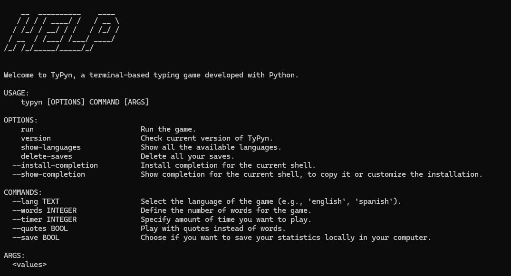

# TyPyn
TyPyn is a terminal-based typing game built with Python.


## Table of Contents
1. [Introduction](#introduction)
2. [Features](#features)
3. [Installation](#installation)
4. [Usage](#usage)
5. [Contributing](#contributing)
6. [Future Improvements](#future-improvements)
7. [Acknowledgements](#acknowledgements)
8. [License](#license)

## Introduction
Welcome to TyPyn, a fun and interactive game designed to improve your typing speed and accuracy. The game runs in the terminal and provides a simple, yet engaging way to practice typing.

## Features
- Simple and user-friendly interface
- Real-time typing feedback
- Tracks typing speed (WPM) and accuracy
- Multiple difficulty levels and gamemodes
- Randomized word lists in several languages
- Score tracking and high scores

## Installation
Before you begin, make sure you have [pip](https://pip.pypa.io/en/stable/installation/) installed. Pip is a package manager for Python that allows you to install and manage additional libraries and dependencies.

To install and run TyPyn, follow these steps:

### Option 1: Install via pip (recommended)
1. Open your terminal.
2. Run the following command to install the Typing Game:

   ```bash
   pip install typyn

### Option 2: Clone the repository
1. Clone the repository:

   ```bash
   git clone https://github.com/san-fernandez/typyn.git

2. Navigate to the project directory:

   ```bash
   cd typyn

3. Install the required dependencies:

   ```bash
   pip install -r requirements.txt

4. Run the application:

   ```bash
   typyn run

## Usage
For usage instructions, you can write `typyn help`:


## Contributing

Contributions are welcome! If you have suggestions for improvements or new features, feel free to submit a pull request or open an issue.

1. **Fork the repository.**

2. **Create a new branch:**

   ```bash
   git checkout -b feature-branch

3. **Make your changes and commit them:**

   ```bash
   git commit -m "Add some feature"

4. **Push to the branch:**

   ```bash
   git push origin feature-branch

5. **Open a pull request.**

## Future Improvements

There are several features we are working on:

- **Game Mode with Timer**: Introduce a timed mode to add a new level of challenge.
- **New Languages**: Expand the game to support additional languages.
- **More Words and Quotes**: Increase the variety of words and add interesting quotes for typing practice.
- **Customizable Themes**: Allow users to customize the game's appearance with different themes.

We welcome your suggestions and contributions!

## Acknowledgements

We would like to thank the developers of [ttyper](https://github.com/max-niederman/ttyper) for their innovative approach. Their project served as a great source of inspiration.

## License
This project is licensed under the MIT License. See the [LICENSE](LICENSE) file for details.
The MIT License is a permissive free software license. It allows you to freely use, modify, and distribute the software as long as you include the original copyright and license notice. For more information, check out the [MIT License](https://opensource.org/licenses/MIT).
